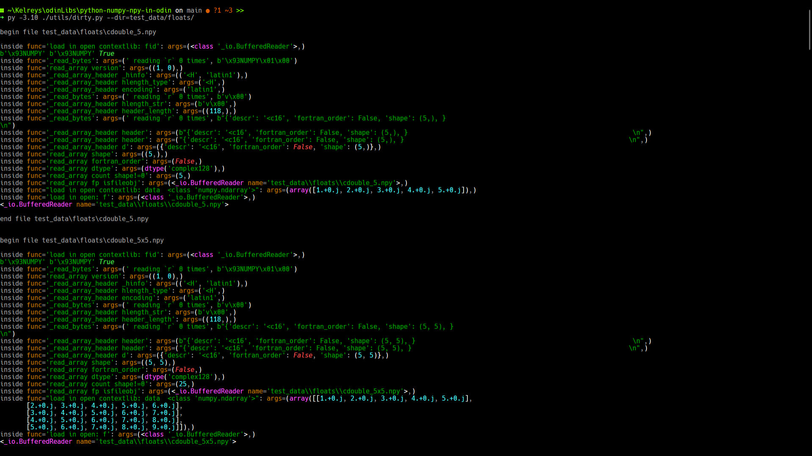

# python-numpy-npy-in-odin

[Python]( https://www.python.org/ )-[ Numpy ](https://github.com/numpy/numpy) `.npy` file reader in [ Odin ](https://odin-lang.org/)

> [!WARNING]
> this repo currently is under development using [ python 3.10 ](https://www.python.org/downloads/release/python-31016/) and [ numpy version 1.26.4 ](https://numpy.org/devdocs/release/1.26.4-notes.html)
> odin version `dev-2025-09:9abc3f67b`


## Example

```odin
    // context.allocator = context.temp_allocator
    default_context = context
    file_name : string = os.args[1]
    defer delete(file_name)
    np_header, ndarray, ok := npyload.load_npy(file_name, allocator=default_context.allocator)
    if ok != nil do fmt.panicf("Wth %v", ok)
    defer npyload.delete_ndarray(ndarray)
    defer npyload.delete_header(&np_header)

```

> [!WARNING]
> idk why, npy files produced by `np.random.rnd` giving weird behaviour.

## Usage

```bash
odin build . -o:speed -out:name-whtvr-youd-like.exe
./name-whtvr-youd-like.exe <path/to/your/file.npy>
```

There also a script to generate plenty of NumPy's npy files

```bash
python ./scripts/generate_array.py
chmod u+x ./scripts/test_all_floats.sh
chmod u+x ./scripts/test_all_ints.sh
bash ./scripts/test_all_floats.sh && bash ./scripts/test_all_ints.sh
```

if you have [Taskfile](https://taskfile.dev/) installed, you can just

```bash
task build && task ints
```


<details>

<summary><h2>TL;DR</h2> </summary>


```python
# in ./generate_array.py

def make_integer_arrays() -> None:
    # ...

    int8_5 = np.arange(1, 6, 1).astype(np.int8)
    np.save("./test_data/ints/int8_5.npy", int8_5)
    int8_5x5     = np.array(list(int8_5 + x for x in range(5)))
    np.save("./test_data/ints/int8_5x5.npy", int8_5x5)

    uint8_5 = np.arange(1, 6, 1).astype(np.uint8)
    np.save("./test_data/ints/uint8_5.npy", uint8_5)
    uint8_5x5     = np.array(list(uint8_5 + x for x in range(5)))
    np.save("./test_data/ints/uint8_5x5.npy", uint8_5x5)

    # ...

    return None

def make_floats_arrays() -> None:
    # ...

    float64 = np.arange(1, 6, 1).astype(np.float64)
    np.save("./test_data/floats/float64_5.npy", float64)

    float64_5x5     = np.array(list(float64 + x for x in range(5)))
    np.save("./test_data/floats/float64_5x5.npy", float64_5x5)

    # ...

    return None

```

```bash

py -3.10 ./generate_array.py
odin build ./main.odin -out:./main.exe
```

```bash
./main.exe ./test_data/floats/float64_5.npy
./main.exe ./test_data/floats/float64_5x5.npy
```
```raw
file: .\test_data\floats\float64_5.npy
Header:
| NumpyHeader{magic = "\x93NUMPY", version = NumpySaveVersion{maj = 1, min = 0}, header_length = 118, header = Descriptor{descr = "<f8", fortran_order = false, shape = [5], endianess = "Little"}}
Data: NDArray{data = [1, 2, 3, 4, 5], size = 8, length = 5}
| size_of that thing: 40 bytes
| with lenght of: 5 bits

file: .\test_data\floats\float64_5x5.npy
Header:
| NumpyHeader{magic = "\x93NUMPY", version = NumpySaveVersion{maj = 1, min = 0}, header_length = 118, header = Descriptor{descr = "<f8", fortran_order = false, shape = [5, 5], endianess = "Little"}}
Data: NDArray{data = [1, 2, 3, 4, 5, 2, 3, 4, 5, 6, 3, 4, 5, 6, 7, 4, 5, 6, 7, 8, 5, 6, 7, 8, 9], size = 8, length = 25}
| size_of that thing: 40 bytes
| with lenght of: 25 bits
```

```bash
./main.exe ./test_data/ints/uint8_5.npy
./main.exe ./test_data/ints/uint8_5x5.npy
```
```raw
file: ./test_data/ints/uint8_5.npy
Header:
| NumpyHeader{magic = "\x93NUMPY", version = NumpySaveVersion{maj = 1, min = 0}, header_length = 118, header = Descriptor{descr = "|u1", fortran_order = false, shape = [5], endianess = "Little"}}
Data: NDArray{data = [1, 2, 3, 4, 5], size = 1, length = 5}
| size_of that thing: 40 bytes
| with lenght of: 5 bits

file: ./test_data/ints/uint8_5x5.npy
Header:
| NumpyHeader{magic = "\x93NUMPY", version = NumpySaveVersion{maj = 1, min = 0}, header_length = 118, header = Descriptor{descr = "|u1", fortran_order = false, shape = [5, 5], endianess = "Little"}}
Data: NDArray{data = [1, 2, 3, 4, 5, 2, 3, 4, 5, 6, 3, 4, 5, 6, 7, 4, 5, 6, 7, 8, 5, 6, 7, 8, 9], size = 1, length = 25}
| size_of that thing: 40 bytes
| with lenght of: 25 bits
```

## Motivations

* I've been coding EXHAUSTIVELY in python, and 've been using numpy since day-1.

* i ain't trying to combine python and odin in a complicated way, but anyway.

* i'll leave the lovely filthy snake alone as the way it is.

* i'll leave the almighty odin alone as the way it is.

* being able to utilized the output from those 2 languages would be great, right?,
esp large data, like `.npy` files.

* as far as my ability to surfing and searching through the internet, i haven't
found single person doing this kinda thing

* inspired by Bill, G.. He wrote about ["Reverse Engineering Alembic"](https://www.gingerbill.org/article/2022/07/11/reverse-engineering-alembic/)
which where He tried to reading [ Alembic ](.http://www.alembic.io/) interchange file format for his
works and his team in [ JangaFX ](https://jangafx.com/) and try to read it in
[ Odin ](https://odin-lang.org/)

* the Numpy Enhancement Proposal (NEP), [NEP 1 — A simple file format for NumPy arrays](https://numpy.org/neps/nep-0001-npy-format.html)

    > _We propose a standard binary file format (NPY) for persisting a single arbitrary NumPy array on disk. The format stores all of the shape and dtype information necessary to reconstruct the array correctly even on another machine with a different architecture. The format is designed to be as simple as possible while achieving its limited goals. The implementation is intended to be pure Python and distributed as part of the main numpy package._
    >
    > **Kern, R. (2007)**

lastly, i want to thank to numpy teams, Ginger Bill, and Rickard Andersson.
i've been watching Rickard's vidoes about Odin in his YouTube to figure out things
to be able to do some parts of this repo. i definitley would recommend you to
check Rickard's vidoes here: [Rick's YouTube](https://www.youtube.com/@mccGoNZooo)

i specifically watched these playlists:

1. [The Odin programming language with Rickard](https://youtube.com/playlist?list=PLEQTpgQ9eFCGlQa2z0j_TQTGggHOIF8Z1&si=nxXgXCB5N0-F0s7D)
2. [Odin in Practice](https://youtube.com/playlist?list=PLEQTpgQ9eFCEg0CTd0KkiqgUpP5V0JM4-&si=oZJoIuzr9s7GXVWu)

## My plans and what done so far

### research, duh!?

1. how numpy save 'em files in disk  [✅]
2. how numpy load 'em .npy files to memory  [✅]

those 2 coherently relates to file descriptor a.k.a header, and the array itself.

### reverse the thing

1. open and read the bytes [✅]
2. reconstruct the file header. File header contains informations of
what and how we can recreate the array [✅]
3. reconstruct the array [✅]

### plans

1. i'll focus on integers and floats first [✅]
2. i'll do some basic 1D arrays and 2D arrays. [✅]
3. the complex dtypes are handled gracefully. [✅]
4. after the reconstructions, it'll be nice to save it back as `.npy` file too!. [❌]

## Workflow

make sure you have numpy 1.26.4 are installed for reproducibility purpose
to check your numpy's version

```bash
python -m pip show numpy
```

### Generate test data

in root dir run [ `./generate_array.py` ](./generate_array.py) to make test data
make sure subdirs `./test_data/ints` and `./test_data/floats/` exist

```bash
mkdir test_data
mkdir test_data/ints test_data/floats
py -3.10 generate_array

```

### Peek inside the `.npy` files

i have utilities to do that in [`/dirty.py`](./utils/dirty.py) which i copied and modified
from numpy's [ `_fromat_impl.py` ](https://github.com/numpy/numpy/blob/82610b4edaf474895a9f4b3ecc0749c7c297099a/numpy/lib/_format_impl.py#L704) thatput [here](./utils/format_impl.py)

after you created the test data, you can run [`dirty.py`](./utils/dirty.py) and
pass a single numpy file or a directory contains `.npy` files

```bash
py -3.10 ./utils/dirty.py --d=./test_data/ints/b_5x5.npy
```

```bash
py -3.10 ./utils/dirty.py --dir=./test_data/floats/
```

if everything is allright, you'll get something like following

```raw

begin file test_data/ints/b_5x5.npy

inside func='load in open contextlib: fid': args=(<class '_io.BufferedReader'>,)
b'\x93NUMPY' b'\x93NUMPY' True
inside func='_read_bytes': args=(' reading `r` 0 times', b'\x93NUMPY\x01\x00')
inside func='read_array version': args=((1, 0),)
inside func='_read_array_header _hinfo': args=(('<H', 'latin1'),)
inside func='_read_array_header hlength_type': args=('<H',)
inside func='_read_array_header encoding': args=('latin1',)
inside func='_read_bytes': args=(' reading `r` 0 times', b'v\x00')
inside func='_read_array_header hlength_str': args=(b'v\x00',)
inside func='_read_array_header header_length': args=((118,),)
inside func='_read_bytes': args=(' reading `r` 0 times', b"{'descr': '|b1', 'fortran_order': False, 'shape': (5, 5), }                                                    
\n")
inside func='_read_array_header header': args=(b"{'descr': '|b1', 'fortran_order': False, 'shape': (5, 5), }                                                          
\n",)
inside func='_read_array_header header': args=("{'descr': '|b1', 'fortran_order': False, 'shape': (5, 5), }                                                          \n",)
inside func='_read_array_header d': args=({'descr': '|b1', 'fortran_order': False, 'shape': (5, 5)},)
inside func='read_array shape': args=((5, 5),)
inside func='read_array fortran_order': args=(False,)
inside func='read_array dtype': args=(dtype('bool'),)
inside func='read_array count shape!=0': args=(25,)
inside func='read_array fp isfileobj': args=(<_io.BufferedReader name='test_data/ints/b_5x5.npy'>,)
inside func="load in open contextlib: data  <class 'numpy.ndarray'>": args=(array([[ True, False,  True, False,  True],
       [ True, False,  True, False,  True],
       [ True, False,  True, False,  True],
       [ True, False,  True, False,  True],
       [ True, False,  True, False,  True]]),)
inside func='load in open: f': args=(<class '_io.BufferedReader'>,)
<_io.BufferedReader name='test_data/ints/b_5x5.npy'>

end file test_data/ints/b_5x5.npy
```

_I use [rich](https://github.com/Textualize/rich) for better color and readibility, it's just preference_

Example output of 1 `.npy` file


Example output of 1 folder



## Now the Odin one

i currently using odin version `dev-2025-03:951bef4ad`

here i use

```bash
odin build npyodin -out:npyodin\main.exe
./main.exe ./test_data/ints/int32_5.npy
```

## TL;DR, 

### Numpy (v1.26.4) DataTypes

source: [Numpy Data Types](https://numpy.org/doc/1.26/user/basics.types.html)

Here's some cleaned output i awk-ed my way through from the outputs of
[`dirty.py`](./utils/dirty.py) 

#### Bool, Byte, and Integer

| Numpy Type | Type in `npy` File Header |
| -------------- | --------------- |
| byte | `\|i1` |
| b | `\|b1` |
| int16 | `<i2` |
| int32 | `<i4` |
| int64 | `<i8` |
| int8 | `\|i1` |
| intc | `<i4` |
| int_ | `<i4` |
| longlong | `<i8` |
| short | `<i2` |
| ubyte | `\|u1` |
| uint8 | `\|u1` |
| uintc | `<u4` |
| ulonglong | `<u8` |
| ushort | `<u2` |

#### Floats

| Numpy Type | Type in `npy` File Header |
| -------------- | --------------- |
| cdouble | `<c16` |
| clongdouble | `<c16` |
| csingle | `<c8` |
| double | `<f8` |
| float16 | `<f2` |
| float32 | `<f4` |
| float64 | `<f8` |
| half | `<f2` |
| longdouble | `<f8` |
| single | `<f4` |

</details>
